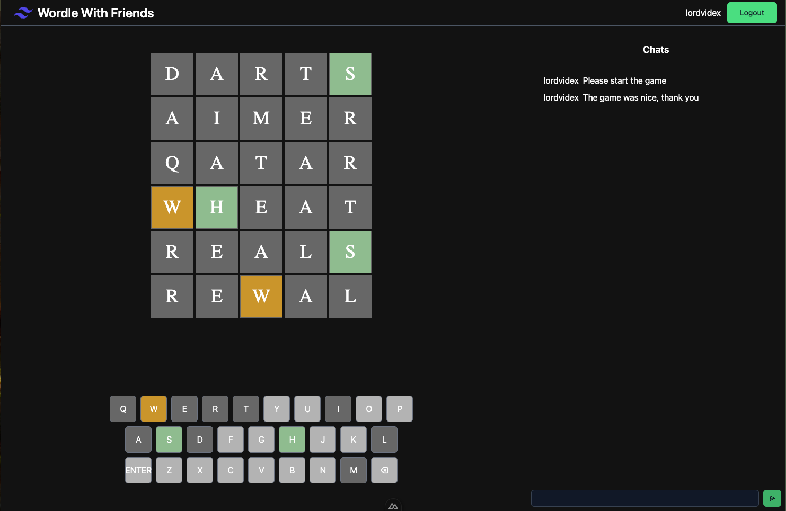

# Wordle UI
[](https://github.com/kodekulture/wordle-ui-vue/actions/workflows/deploy-dev.yml)
[](https://github.com/kodekulture/wordle-ui-vue/actions/workflows/deploy-prod.yml)
## Showcase 


## Features
- [x] Basic authentication
- [x] Real-time chat (messages get wiped during reconnection)
- [x] Game reconnection
- [x] Word hints (green, amber and grey colors)
- [ ] Leaderboard
- [ ] Messages describing other player's actions (left the room, joined the room, etc)
- [ ] Smooth UI/UX 

## Setup

1. Start the wordle server.
2. Set the URL value in nuxt.config.ts
```js
 runtimeConfig: {
    public: {
      baseURL: 'http://localhost:9000'
    }
  }
```
3. Run server in dev mode 
```bash 
yarn && yarn run dev
```
